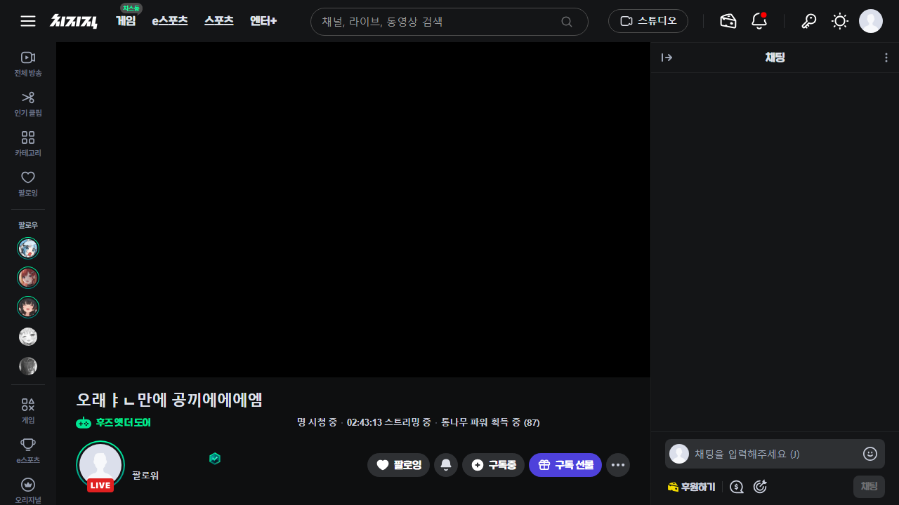
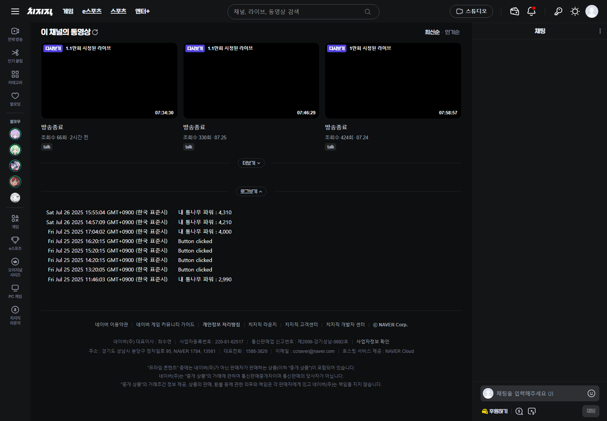
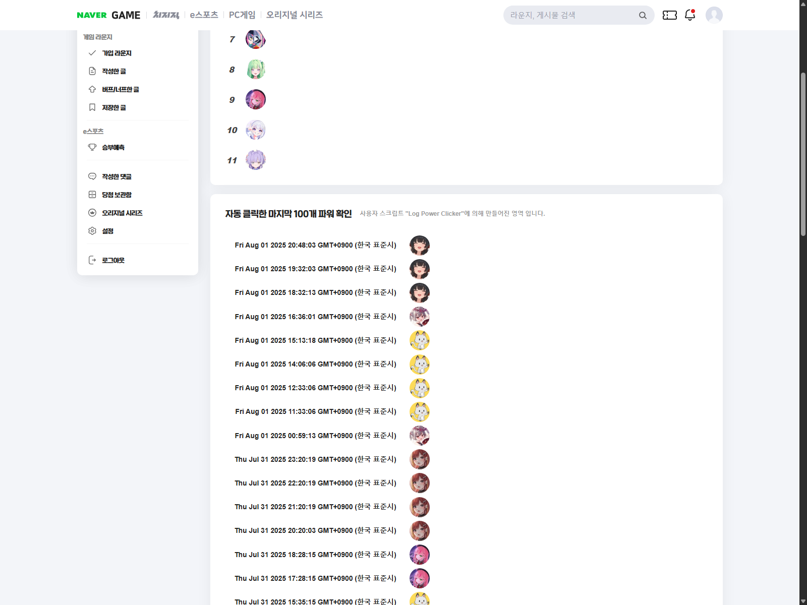

# Log-Power-Clicker
치지직 "1시간 라이브 시청 후 인증하기" 버튼을 자동으로 클릭하는 Tampermonkey 사용자 스크립트입니다.

## 기능
* 20초마다 확인하여 "1시간 라이브 시청 후 인증하기" 버튼이 생기면 자동으로 클릭
* 6분마다 확인하여 통나무 파워 획득 상태 확인 [[사진 1]](#사진-1)
* 라이브 시청 시작 시, 현재 내 통나무 파워 기록 (라이브 중 한 번)
* 라이브 화면 하단에 로그 보기 버튼 생성 [[사진 2]](#사진-2)
    * 자동으로 클릭된 "1시간 라이브 시청 후 인증하기" 시각 확인
    * 라이브 시청 시작 시, 기록된 내 통나무 파워 및 시각 확인
* 네이버 게임 프로필의 [내 통나무 파워](https://game.naver.com/profile#channel_power)에서 자동 클릭한 마지막 100개 파워 확인 [[사진 3]](#사진-3)

## 설치 방법
1. 확장프로그램 Tampermonkey 설치
    * https://www.tampermonkey.net/
2. 사용자 스크립트 Log-Power-Clicker 설치
    * https://github.com/makeAppsGreat/Log-Power-Clicker/raw/refs/heads/main/Log_Power_Clicker.user.js

## 설치 확인
옳게 설치되면 새로고침 후 라이브 화면 하단에 "로그보기" 버튼이 생깁니다.
> [!IMPORTANT]
> 사용자 스크립트가 올바르게 작동하지 않으면 [[링크]](https://www.tampermonkey.net/faq.php#Q209)를 참고해 주세요. (확장 프로그램 개발자 모드 설정 및 Chrome/Edge 138+에서 사용자 스크립트 허용)

## 주요 변경 사항
### 2025-08-03
* 라이브 시청 시작 시, 현재 내 통나무 파워 기록하는 기능 추가
* 통나무 파워 획득 상태 확인하는 기능 추가
### 2025-07-25
* 네이버 게임 / 내 프로필 / 내 통나무 파워에서 최근 자동 클릭한 파워 확인 추가

***
> [!WARNING]
> 사용 중 발생하는 문제는 게시자가 책임지지 않습니다.

## 미리 보기
#### 사진 1

파워 획득 상태

#### 사진 2

로그 버튼 및 기록된 로그

#### 사진 3

자동 클릭한 마지막 100개 파워

